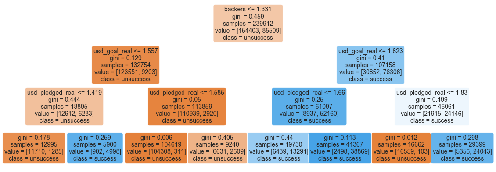
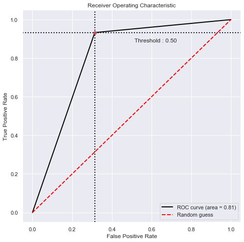
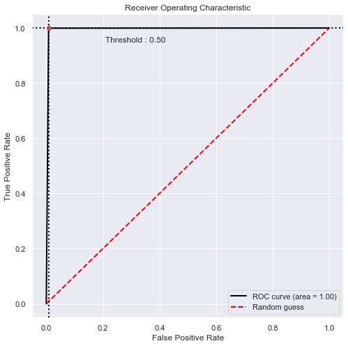

<p align="center">
  
</p>

# Project success analysis
 Several ML algorithms are applied to determine whether a project will be successful, or not.


 
### Project statement
In this tutorial, I applied several ML algorithms to data set to determine if a project would be successful or not. 
First, the data is uploaded and cleaned. The two columns are deleted and the new column is replaced. The feathered data are transferred using power transformation.
The feathered, transferred data are fed into the ML algorithms and results are analyzed. The visualization of decision tree algorithms is presented at the end along with recommendations.

```
Project
  
|__ 1. Missed values
|__ 2. Adding a new column to data  
|__ 3. Delete some useless columns
|__ 4. Visualization 
|__ 5. Parameters Featuring and Transforming (Dealing with those parameters that are an object not digit)
|__ 6. Splitting data (train, validate and test)
|__ 7. Fitting ML models (Random Forest, Logistic Regression, Decision Tree, Gaussian, Linear SVC)
|__ 8. Accuracy, Precision, Sensitivity or Recall, F1 score concepts
|__ 9. Evaluating Model Performances

```


---
### Project structure:

```
Project_Success_Analysis
  
|__ code/
|   |__ All parts- Project success analysis.ipynb  
|   |__ Part 1- load data and cleaning.ipynb 
|   |__ Part 2- EDA.ipynb 
|   |__ Part 3- Modeling.ipynb
|__ dataset/
|__ assets
|__ README.md
```
---


<p align="center">
  
</p>
---
<p align="center">
  
</p>


---
<p align="center">
  
</p>


---
<p align="center">
  
</p>


# Recommendations
---
* Note that we did not check out the number of 1 to the number of 0. The ratio in this project is 35(1) to 65(0). This can results model to achieve bias toward 0 predictions. In the case of low accuracy results, we can use the oversampling technique and follow the same steps above.
* The confusion matrix shows good results therefore we don't need to consider oversampling procedure.
```
confusion_matrix = 
 [[38207   299]
 [  322 21151]]
```
* The ML algorithms results are promising with an average accuracy of 0.93.
* The same project can be solved as a multi-classification (5 separate output).
* No ML algorithm hyperparameter tuning done. In case of not having a good results, the hyper-paramter optimization is suggested.

