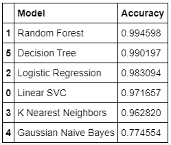

<p align="center">
  
</p>

# Project success analysis
 Several ML algorithms are applied to determine whether a project will be successful, or not.


 
### Project statement
In this tutorial, I applied several ML algorithms to data set to determine if a project would be successful or not. 
First, the data is uploaded and cleaned. The two columns are deleted and the new column is replaced. The feathered data are transferred using power transformation.
The feathered, transferred data are fed into the ML algorithms and results are analyzed. 

The visualization of decision tree algorithms is presented along with recommendations at the end.


```
Project
  
|__ 1. Missed values.
|__ 2. Adding a new column to data.
|__ 3. Delete some useless columns.
|__ 4. Visualization.
|__ 5. Parameters Featuring and Transforming.
|__ 6. Splitting data (train, validate and test).
|__ 7. Fitting ML models (Random Forest, Logistic Regression, Decision Tree, Gaussian, Linear SVC).
|__ 8. Accuracy, Precision, Sensitivity or Recall, F1 score concepts.
|__ 9. Evaluating Model Performances.

```


---
### Project structure:

The structure of the project is provided at the following. The project composed of three separate parts. 
In Part 1, the data is uploaded and cleaned. In the second part, the Exploratory data analysis is conducted on data. 
In part 1, new feathered data is produced and whole data is transferred. 
The transformed, cleaned, feathered data are divided to train and test and fed into several machine learning algorithms.
The concepts for Accuracy, Precision, Sensitivity, or Recall, F1 score are presented. In addition, the ROC for each algorithm is plotted and presented.
At the end, a table of results is shown.

```
Project_Success_Analysis
  
|__ code/
|   |__ All parts- Project success analysis.ipynb  
|   |__ Part 1- load data and cleaning.ipynb 
|   |__ Part 2- EDA.ipynb 
|   |__ Part 3- Modeling.ipynb
|__ dataset/
|__ assets
|__ README.md
```
---

### PART 1 - Loading data and cleaning
The data is loaded and several inspections including the shape of data, number of numerical and categorical columns, the mean, std, min and max, and number of nulls and assigned columns are investigated.
The null values rows are ignored (deleted) and the data is saved into the dataset folder.


### PART 2 - Exploratory data analysis (EDA)
In this section, the data was feathered. The deadline data was subtracted from the launched data to find out the number fo days availbe for each project. 
The categorical parameters are turned into numerical one plus the data was transferred utilizing power transformers. The objective of this project is to predict whether a project is successful or not. therefore a filter is applied and the number 1 is assigned to successful projects, while the number 0 is assigned to other projects states including, failed, canceled, etc.
The data distribution before and after transformation is seen below.

**Data Before Transformation:**

<p align="center">
  
</p>


**Data After Transformation:**

<p align="center">
  
</p>


### PART 3 - Modeling using Machine learning Algorithms

In this section, the cleaned data from the previous section is used for training ML algorithms.
This is a multi-classification problem. the data is split with 80% training and 20% test data.
The training data is split with the same ratio to training and validation sets.
The ML algorithms including KNN, Random-Forest, Logistic-Regression, Decision-Tree, GaussianNB, and linear Support vector classifiers are applied.
The model accuracy table was presented at the end. It was found that the Random Forest and Decision tree algorithms are the most successful in predicting the project's success.


At the following two visulazation of desion-tree algorithm with max depth of three are presented.


* Text_representation of desion tree

```
|--- feature_6 <= 1.33
|   |--- feature_10 <= 1.56
|   |   |--- feature_9 <= 1.42
|   |   |   |--- class: 0
|   |   |--- feature_9 >  1.42
|   |   |   |--- class: 1
|   |--- feature_10 >  1.56
|   |   |--- feature_9 <= 1.58
|   |   |   |--- class: 0
|   |   |--- feature_9 >  1.58
|   |   |   |--- class: 0
|--- feature_6 >  1.33
|   |--- feature_10 <= 1.82
|   |   |--- feature_9 <= 1.66
|   |   |   |--- class: 1
|   |   |--- feature_9 >  1.66
|   |   |   |--- class: 1
|   |--- feature_10 >  1.82
|   |   |--- feature_9 <= 1.83
|   |   |   |--- class: 0
|   |   |--- feature_9 >  1.83
|   |   |   |--- class: 1
```
* The Desion Tree with max depth of three

<p align="center">
  
</p>

---


**The ROC curves for Random-Forest Algorithm**
As it is seen the results are promising using the random forest algorithm for estimating the success of a project.

* ROC-curve for Random-Forest Algorithm

<p align="center">
  
</p>

While the below ROC-curve demonstrate the Gaussian algorithm is not applicable in this case. 

* ROC-curve for Gaussina NB Algorithm

<p align="center">
  
</p>
---


---
<p align="center">
  
</p>


# Recommendations
---

* Note that we did not check out the number of 1 to the number of 0. The ratio in this project is 35(1) to 65(0). This can results model to achieve bias toward 0 predictions. In the case of low accuracy results, we can use the oversampling technique and follow the same steps above.
* The confusion matrix shows good results therefore we don't need to consider oversampling procedure.
```
confusion_matrix = 
 [[38207   299]
 [  322 21151]]
```
* The ML algorithms results are promising with an average accuracy of 0.93.
* The same project can be solved as a multi-classification (5 separate output).
* No ML algorithm hyperparameter tuning done. In case of not having a good results, the hyper-paramter optimization is suggested.

